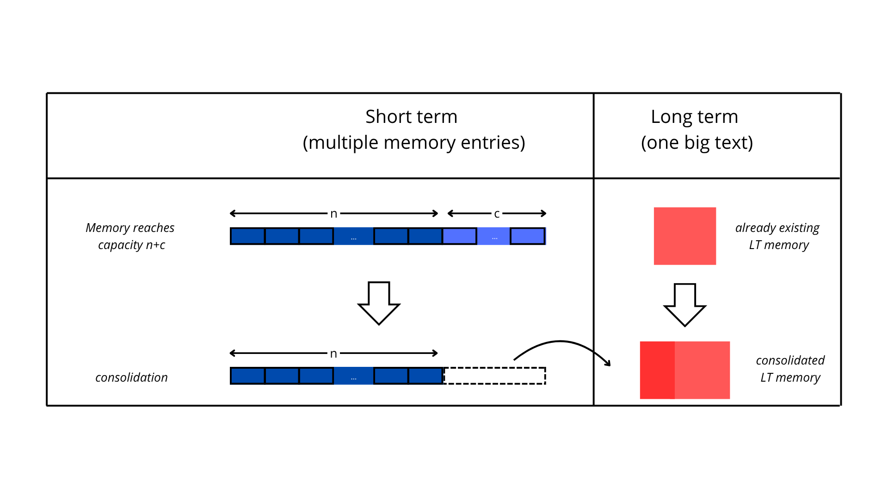

# Memory module

The memory system in Mesa-LLM provides different types of memory implementations that enable agents to store and retrieve past events (conversations, observations, actions, messages, plans, etc.). Memory serves as the foundation for creating agents with persistent, contextual awareness that enhances their decision-making capabilities. The memory module contains two classes.

---
### class MemoryEntry(content : dict, step : int, agent : LLMAgent)
A data structure that stores individual memory records with content, step number, and agent reference. Each entry includes `rich` formatting for display. Content is a nested dictionary of arbitrary depth containing the entry's information. Each entry is designed to hold all the information of a given step for an agent, but can also be used to store a single event if needed.

**Attributes:**
- **content** (nested dict)
- **step** (int)
- **agent** (LLMAgent reference)

---
### class Memory(agent : LLMAgent, api_key : str = None, llm_model : str = None, display : bool = True)
Provides the foundational interface for all memory implementations. It handles memory entry creation, display management, and basic content filtering to avoid storing redundant observations.

**Attributes:**
- **agent** (LLMAgent)
- **llm** (optional ModuleLLM)
- **display** (bool)
- **step_content** (dict)
- **last_observation** (dict)

**Methods:**
- **add_to_memory(type, content)** - Add new entry to memory system

**Content Addition**
- Before each agent step, the agent can add new events to the memory through `add_to_memory(type, content)` so that the memory can be used to reason about the most recent events as well as the past events.
- During the step, actions, messages, and plans are added to the memory through `add_to_memory(type, content)`
- At the end of the step, the memory is processed via `process_step()`, managing when memory entries are added,consolidated, displayed, or removed

## Built-in Memory Types

### class STLTMemory(agent : LLMAgent, short_term_capacity : int = 5, consolidation_capacity : int = 2, display : bool = True, api_key : str = None, llm_model : str = "openai/gpt-4o-mini")
Implements a dual-memory system where recent experiences are stored in short-term memory with limited capacity, and older memories are consolidated into long-term summaries using LLM-based summarization.

**Attributes:**
- **short_term_memory** (deque)
- **long_term_memory** (string)
- **capacity** (int)
- **consolidation_capacity** (int)

**Methods:**
- **process_step(pre_step=False)** - Process current step's memory content
- **format_long_term()** → *str* - Get formatted long-term memory
- **format_short_term()** → *str* - Get formatted short-term memory


**Logic behind the implementation**:
- **Short-term capacity**: Configurable number of recent memory entries (default: short_term_capacity = 5)
- **Consolidation**: When capacity is exceeded, oldest entries are summarized into long-term memory (number of entries to summarize is configurable, default: consolidation_capacity = 3)
- **LLM Summarization**: Uses a separate LLM instance to create meaningful summaries of past experiences




---
### class ShortTermMemory(agent : LLMAgent, n : int = 5, display : bool = True)
Simple short-term memory implementation without consolidation (stores recent entries up to capacity limit). Same functionality as `STLTMemory` but without the long-term memory and consolidation mechanism.

**Attributes:**
- **short_term_memory** (deque)
- **n** (int)

**Methods:**
- **process_step(pre_step=False)** - Process current step's memory content

---
### class EpisodicMemory(agent : LLMAgent, api_key : str = None, llm_model : str = None, display : bool = True, max_memory : int = 10)
Stores memories based on event importance scoring. Each new memory entry is evaluated by an LLM for its relevance and importance (1-5 scale) relative to the agent's current task and previous experiences. Based on a Stanford/DeepMind paper: [Generative Agents: Interactive Simulacra of Human Behavior](https://arxiv.org/pdf/2304.03442)

**Attributes:**
- **memory** (deque)
- **max_memory** (int)

**Methods:**
- **grade_event_importance(type, content)** → *float* - Evaluate event importance using LLM

---
## Usage in Mesa Simulations


```python
from mesa_llm.llm_agent import LLMAgent
from mesa_llm.memory.st_lt_memory import STLTMemory

class MyAgent(LLMAgent):
    def __init__(self, model, api_key, reasoning, **kwargs):
        super().__init__(model, api_key, reasoning, **kwargs)

        # Override default memory with custom configuration
        self.memory = STLTMemory(
            agent=self,
            short_term_capacity=10,    # Store 10 recent experiences
            consolidation_capacity=3, # Consolidate when 13 total entries
            api_key=api_key,
            llm_model="openai/gpt-4o-mini",
            display=True            # Display the memory entries in the console when they are added to the memory
        )
```

